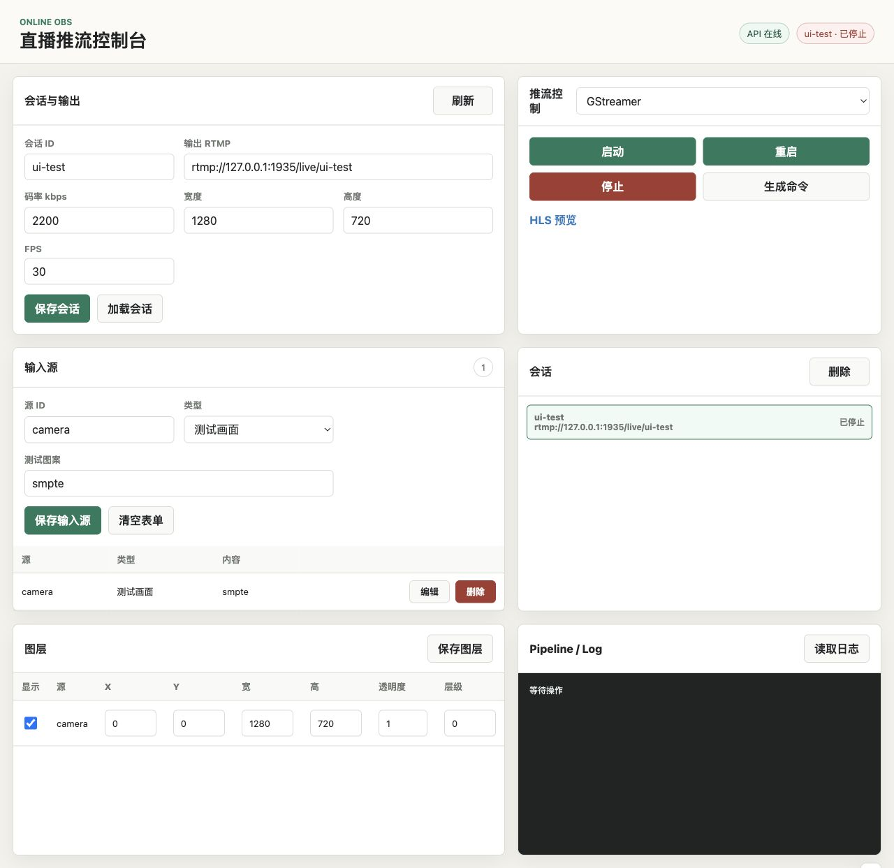
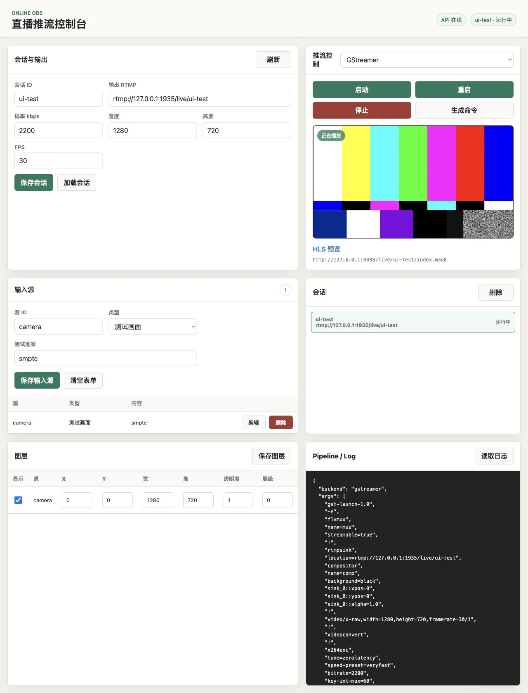
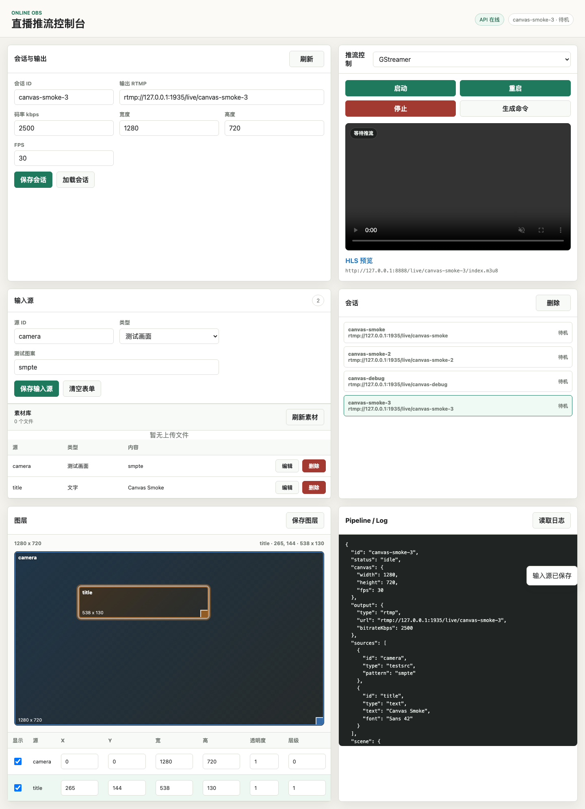
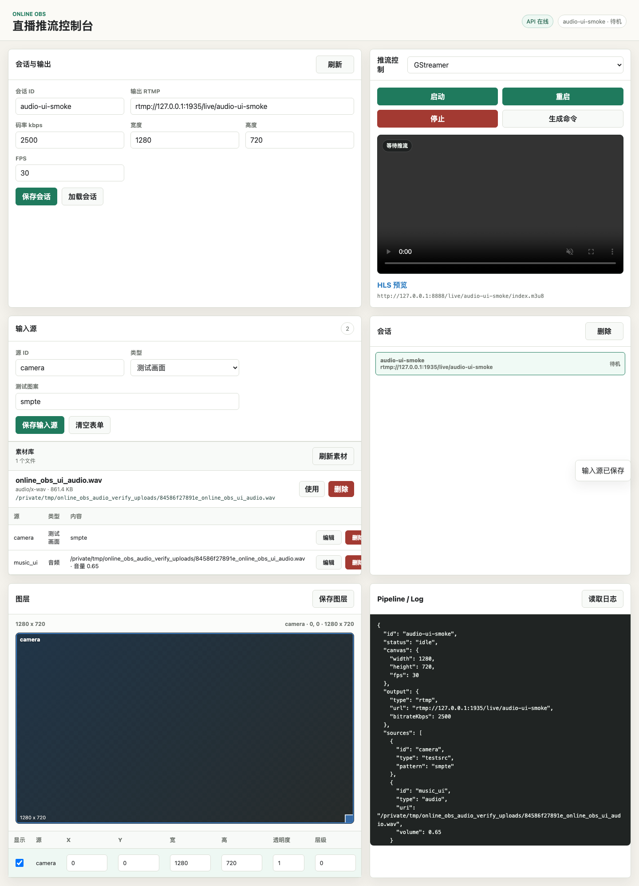
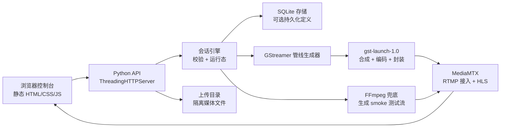

# Online OBS

Online OBS 是一个无头化、可通过浏览器控制的直播合成服务。它提供类似 OBS 的操作台，但核心状态和推流流程都由本地 API 驱动，因此可以把场景、输入源、素材上传、预览和 RTMP 推流放到服务端进程里管理，而不是依赖桌面采集软件。

当前项目适合本地直播工具、自动化实验、云端视频合成原型，以及需要用 API 控制直播场景的可信网络环境。

## 项目目的

桌面版 OBS 很适合人工交互式直播。Online OBS 探索的是另一种形态：

- 操作界面在浏览器中运行
- 会话和场景状态由 API 管理，便于脚本化和持久化
- 使用 GStreamer 构建合成、编码和 RTMP 输出管线
- 使用 MediaMTX 提供本地 RTMP 接入和 HLS 预览
- 通过 smoke 脚本和 Docker Compose 让关键流程可复现、可验证

这还不是一个多租户直播平台。它目前是一个小而清晰的基础项目，面向单机或可信网络内的直播控制工作流。

## 功能特性

- 会话、输入源、场景、动画、推流控制、上传素材和日志 API
- 由 API 进程直接提供的静态 Web 控制台
- 支持拖拽和缩放的可视化画布编辑器，同时保留精确表格编辑
- 支持测试画面、本地视频文件、图片、RTMP、RTSP、文字和音频输入源
- GStreamer RTMP 输出，支持 H264 视频、AAC 音频、静音兜底音轨和真实音频混流
- FFmpeg 兜底后端，用于生成测试流和轻量 smoke 测试
- 通过 MediaMTX 提供 HLS 预览
- 可选 SQLite 持久化会话定义和上传素材元数据
- 可选 Bearer Token 鉴权、上传大小/类型限制和上传路径隔离
- API + MediaMTX 的 Docker Compose 本地栈
- OpenAPI JSON、smoke 脚本、CI workflow 和 release workflow

## 截图



控制台可以在一个页面里管理会话、输入源、上传素材、图层、输出设置、推流控制、预览和进程日志。



推流启动后，控制台会根据 RTMP 输出地址推导 MediaMTX 的 HLS 地址，并自动打开实时预览。



场景图层可以在画布上选择、拖拽和缩放；下方表格仍然作为精确数值编辑器。



音频文件可以上传或作为 `audio` 输入源引用，设置独立音量，并混入 RTMP 输出。

## 架构设计



主要模块职责：

- `online_obs/service.py`：HTTP 路由、静态资源、上传、鉴权和公共配置。
- `online_obs/models.py`：规范化和校验 API 中可持久化的 payload。
- `online_obs/engine.py`：会话生命周期、持久化钩子、进程管理、日志和后端选择。
- `online_obs/pipeline.py`：生成 GStreamer 命令，负责视频合成、RTMP 封装、静音 AAC 兜底、文件循环元数据和音频混流。
- `online_obs/ffmpeg_pipeline.py`：轻量 FFmpeg 生成流兜底后端，和主 GStreamer 路径分离。
- `online_obs/storage.py`：在启用 SQLite 时持久化会话定义和上传素材元数据。
- `online_obs/static/`：无需前端构建系统的浏览器控制台。

## 快速开始

macOS 依赖：

```bash
brew install gstreamer mediamtx ffmpeg
```

启动本地 RTMP/HLS 服务：

```bash
mediamtx /opt/homebrew/etc/mediamtx/mediamtx.yml
```

启动 API：

```bash
python3 -m online_obs --host 127.0.0.1 --port 8080
```

启用 SQLite 持久化会话定义：

```bash
python3 -m online_obs --host 127.0.0.1 --port 8080 --db .data/online_obs.sqlite3
```

也可以设置 `ONLINE_OBS_DB=/path/to/online_obs.sqlite3`。会话画布、输出、输入源、场景和动画会被持久化；运行中的进程、日志和生成的管线信息会在运行时重建。

常用运行配置：

```bash
ONLINE_OBS_HOST=127.0.0.1
ONLINE_OBS_PORT=8080
ONLINE_OBS_UPLOAD_DIR=uploads
ONLINE_OBS_DB=.data/online_obs.sqlite3
ONLINE_OBS_GST_PLUGIN_DIR=gst-min-plugins
ONLINE_OBS_HLS_HOST=127.0.0.1
ONLINE_OBS_HLS_PORT=8888
ONLINE_OBS_AUTH_TOKEN=
ONLINE_OBS_MAX_UPLOAD_BYTES=1073741824
ONLINE_OBS_ALLOWED_UPLOAD_TYPES=video/*,audio/*,image/*
```

对应的 CLI 参数：

```bash
python3 -m online_obs \
  --host 127.0.0.1 \
  --port 8080 \
  --upload-dir uploads \
  --db .data/online_obs.sqlite3 \
  --gst-plugin-dir gst-min-plugins \
  --hls-host 127.0.0.1 \
  --hls-port 8888 \
  --auth-token "$ONLINE_OBS_AUTH_TOKEN" \
  --max-upload-bytes 1073741824 \
  --allowed-upload-types 'video/*,audio/*,image/*'
```

浏览器控制台会读取 `GET /config`，因此 HLS 预览可以跟随非默认的 MediaMTX host 或 port。

打开控制台：

```text
http://127.0.0.1:8080/
```

控制台会根据 RTMP 输出地址推导 HLS URL，并在推流启动后自动播放 `index.m3u8`。它也会轮询当前会话状态，在推流进程退出时更新预览和日志。

当设置了 `ONLINE_OBS_AUTH_TOKEN` 或 `--auth-token` 时，API 会要求会话、输入源、场景、推流控制和上传接口带上 `Authorization: Bearer <token>`。`/health`、`/config`、`/openapi.json` 和静态控制台资源保持公开，方便操作者加载页面并在 API Token 输入框中填写 token。

健康检查：

```bash
curl http://127.0.0.1:8080/health
```

列出会话：

```bash
curl http://127.0.0.1:8080/sessions
```

OpenAPI 文档：

```text
http://127.0.0.1:8080/openapi.json
```

同一份文档也保存在 `docs/openapi.json`，方便贡献者阅读或生成客户端。

发布说明和发布流程：

```text
CHANGELOG.md
docs/release.md
```

## Docker Compose

启动本地 API + MediaMTX：

```bash
docker compose up -d --build
```

如果默认端口被占用，可以映射到其他宿主机端口：

```bash
ONLINE_OBS_API_PORT=18080 \
ONLINE_OBS_RTMP_PORT=11935 \
ONLINE_OBS_HLS_PORT=18888 \
docker compose up -d --build
```

运行 Compose smoke 测试：

```bash
scripts/smoke_compose.sh
```

使用备用端口运行：

```bash
ONLINE_OBS_API_PORT=18080 \
ONLINE_OBS_RTMP_PORT=11935 \
ONLINE_OBS_HLS_PORT=18888 \
scripts/smoke_compose.sh
```

默认 Compose 镜像刻意保持轻量，使用 FFmpeg 后端生成测试流。若要运行包含完整 GStreamer runtime 的 API 容器，叠加 GStreamer override：

```bash
docker compose -f docker-compose.yml -f docker-compose.gstreamer.yml up -d --build
BACKEND=gstreamer scripts/smoke_compose.sh
```

GStreamer 镜像安装当前 RTMP 管线需要的 Debian GStreamer 插件集，通过 `ONLINE_OBS_GST_PLUGIN_DIR=""` 禁用仓库里的 macOS 精简插件目录，并通过 `ONLINE_OBS_AAC_ENCODER=avenc_aac` 使用 `avenc_aac`。

smoke 脚本会让 API 容器推流到 Compose 内部固定 IP `10.89.0.10` 上的 MediaMTX，再从宿主机映射端口探测 RTMP/HLS。

Compose 会把 SQLite 数据库存到 `online_obs_data` volume，把上传素材存到 `online_obs_uploads` volume。

停止本地栈：

```bash
docker compose down
```

## 最小 API 流程

创建会话：

```bash
curl -X POST http://127.0.0.1:8080/sessions \
  -H 'Content-Type: application/json' \
  -d '{
    "id": "demo",
    "canvas": {"width": 1280, "height": 720, "fps": 30},
    "output": {"type": "rtmp", "url": "rtmp://example/live/stream"}
  }'
```

更新会话：

```bash
curl -X PUT http://127.0.0.1:8080/sessions/demo \
  -H 'Content-Type: application/json' \
  -d '{
    "canvas": {"width": 1280, "height": 720, "fps": 30},
    "output": {"type": "rtmp", "url": "rtmp://127.0.0.1:1935/live/demo", "bitrateKbps": 2500}
  }'
```

添加输入源：

```bash
curl -X POST http://127.0.0.1:8080/sessions/demo/sources \
  -H 'Content-Type: application/json' \
  -d '{"id": "camera", "type": "testsrc", "pattern": "smpte"}'

curl -X POST http://127.0.0.1:8080/sessions/demo/sources \
  -H 'Content-Type: application/json' \
  -d '{"id": "title", "type": "text", "text": "Online OBS"}'

curl -X POST http://127.0.0.1:8080/sessions/demo/sources \
  -H 'Content-Type: application/json' \
  -d '{"id": "music", "type": "audio", "uri": "/path/to/music.wav", "volume": 0.75}'
```

更新或删除输入源：

```bash
curl -X PUT http://127.0.0.1:8080/sessions/demo/sources/title \
  -H 'Content-Type: application/json' \
  -d '{"type": "text", "text": "Live title"}'

curl -X DELETE http://127.0.0.1:8080/sessions/demo/sources/title
```

设置场景：

```bash
curl -X PUT http://127.0.0.1:8080/sessions/demo/scene \
  -H 'Content-Type: application/json' \
  -d @examples/mvp_scene.json
```

只生成 GStreamer 命令，不真正启动：

```bash
curl -X POST http://127.0.0.1:8080/sessions/demo/start \
  -H 'Content-Type: application/json' \
  -d '{"dryRun": true}'
```

使用 GStreamer 真正推流：

```bash
curl -X POST http://127.0.0.1:8080/sessions/demo/start \
  -H 'Content-Type: application/json' \
  -d '{"backend": "gstreamer"}'
```

如果存在 `gst-min-plugins/`，API 会自动使用它，从而避免 macOS 上完整 GStreamer 插件扫描缓慢或卡住。

使用 FFmpeg 兜底后端启动：

```bash
curl -X POST http://127.0.0.1:8080/sessions/demo/start \
  -H 'Content-Type: application/json' \
  -d '{"backend": "ffmpeg"}'
```

验证本地 RTMP 流：

```bash
ffprobe -v error \
  -show_entries stream=codec_type,codec_name,width,height \
  -of json \
  rtmp://127.0.0.1:1935/live/demo
```

验证 MediaMTX HLS：

```bash
curl -L http://127.0.0.1:8888/live/demo/index.m3u8
```

停止推流：

```bash
curl -X POST http://127.0.0.1:8080/sessions/demo/stop
```

使用最新配置重启：

```bash
curl -X POST http://127.0.0.1:8080/sessions/demo/restart \
  -H 'Content-Type: application/json' \
  -d '{"backend": "gstreamer"}'
```

读取捕获到的 GStreamer/FFmpeg stderr 日志：

```bash
curl http://127.0.0.1:8080/sessions/demo/logs
```

删除会话：

```bash
curl -X DELETE http://127.0.0.1:8080/sessions/demo
```

## 上传素材

上传本地视频或音频文件，用作 `file` 或 `audio` 输入源：

```bash
curl -X POST http://127.0.0.1:8080/uploads \
  -F "file=@/path/to/clip.mp4;type=video/mp4"
```

列出上传素材：

```bash
curl http://127.0.0.1:8080/uploads
```

按 `storedName` 删除上传素材：

```bash
curl -X DELETE http://127.0.0.1:8080/uploads/<storedName>
```

控制台的输入源区域包含素材库。选择已上传的视频会填入 `file` 输入源路径；选择已上传的音频会填入 `audio` 输入源路径。

上传文件只会写入配置的上传目录。服务端会强制执行 `ONLINE_OBS_MAX_UPLOAD_BYTES` 和 `ONLINE_OBS_ALLOWED_UPLOAD_TYPES`；后者支持 `video/*` 这样的通配项，也支持 `audio/wav` 这样的精确类型。

对上传或本地视频文件，可以启用 `loop`，让 GStreamer 文件管线在片段结束时重新启动：

```bash
curl -X POST http://127.0.0.1:8080/sessions/demo/sources \
  -H 'Content-Type: application/json' \
  -d '{"id": "clip", "type": "file", "uri": "/path/to/clip.mp4", "loop": true}'
```

对上传或本地音频文件，使用 `audio` 输入源。GStreamer 会通过 `audiomixer` 混合所有音频源；`volume` 取值范围为 `0` 到 `2`：

```bash
curl -X POST http://127.0.0.1:8080/sessions/demo/sources \
  -H 'Content-Type: application/json' \
  -d '{"id": "music", "type": "audio", "uri": "/path/to/music.wav", "volume": 0.75}'
```

## 当前限制

- 除非设置 `--db` 或 `ONLINE_OBS_DB`，否则状态只保存在内存中。
- 启用 SQLite 后会持久化上传素材元数据；没有元数据的旧文件会继续从目录和 MIME 猜测中派生展示信息。
- API 已表达动态管线变更，但运行中的推流还不会热更新；修改场景或输入源后请使用 `restart` 生效。
- 视频文件只有在输入源设置 `"loop": true` 时才循环；当前循环方式是在文件结束后重启管线，不是帧级无缝循环。
- 文字图层使用基础 `textoverlay` 管线。生产级渲染后续应考虑 `Skia / Cairo / Canvas / Lottie -> appsrc -> GStreamer`。
- `ffmpeg` 后端是本地 smoke 测试兜底，目前只支持生成测试视频/音频流到 RTMP。
- GStreamer RTMP 输出在配置了 `audio` 输入源时会混音；纯视频或生成管线仍使用静音 AAC 兜底。详细 A/V 同步策略目前仍较简单。
- 本地真实执行仍需要安装 GStreamer；没有 GStreamer 时可以使用 dry-run。

## 部署安全

- 如果 API 绑定到 `127.0.0.1` 以外的地址，请先设置 `ONLINE_OBS_AUTH_TOKEN`。
- 远程浏览器或远程操作者参与时，请把服务放在 TLS 或可信私有网络之后。
- 将 `ONLINE_OBS_UPLOAD_DIR` 放在独立数据卷中，不要与源码或密钥目录混用。
- 根据实际工作流收紧 `ONLINE_OBS_MAX_UPLOAD_BYTES` 和 `ONLINE_OBS_ALLOWED_UPLOAD_TYPES`。
- 本地 `file`、`audio`、`image`、RTMP 和 RTSP 输入源 URI 都应视为可信操作者输入；不要把当前 API 直接作为公开多租户服务暴露。

## 长期开发 Harness

本项目使用 `.harness/` 作为仓库内的长期开发记忆。

每次开发会话先阅读：

```text
.harness/PROJECT_GOAL.md
.harness/STATE.md
.harness/BACKLOG.md
.harness/DECISIONS.md
.harness/RELEASE_CRITERIA.md
.harness/RUNBOOK.md
```

查看下一个推荐任务：

```bash
scripts/harness_next.py
```

运行默认检查：

```bash
scripts/dev_check.sh
```

GitHub Actions 会在 pull request 以及推送到 `main` 或 `release/**` 时运行相同的核心检查。匹配 `v*.*.*` 的 tag 会触发 release workflow，并发布 lean 与 GStreamer 两种 API 镜像到 GHCR；详见 `docs/release.md`。

当 API 和 MediaMTX 正在运行时，可以运行 live smoke 测试：

```bash
scripts/smoke_rtmp.sh
scripts/smoke_upload_file.sh
scripts/smoke_audio_mix.sh
scripts/smoke_compose.sh
```

标准恢复提示：

```text
继续执行 .harness/RUNBOOK.md。先执行 Decomposition Gate，必要时把当前进行中或下一个 P0/P1 任务拆成更小任务；然后完成一个具体任务切片。完成后更新 STATE、BACKLOG、DECISIONS，并运行 dev_check。
```
